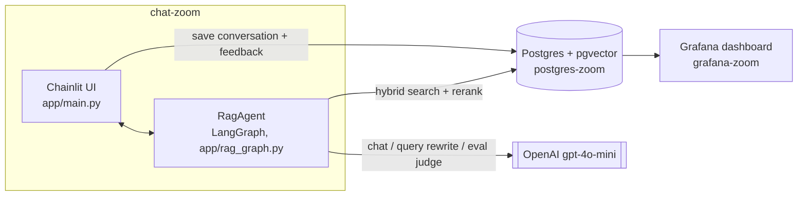
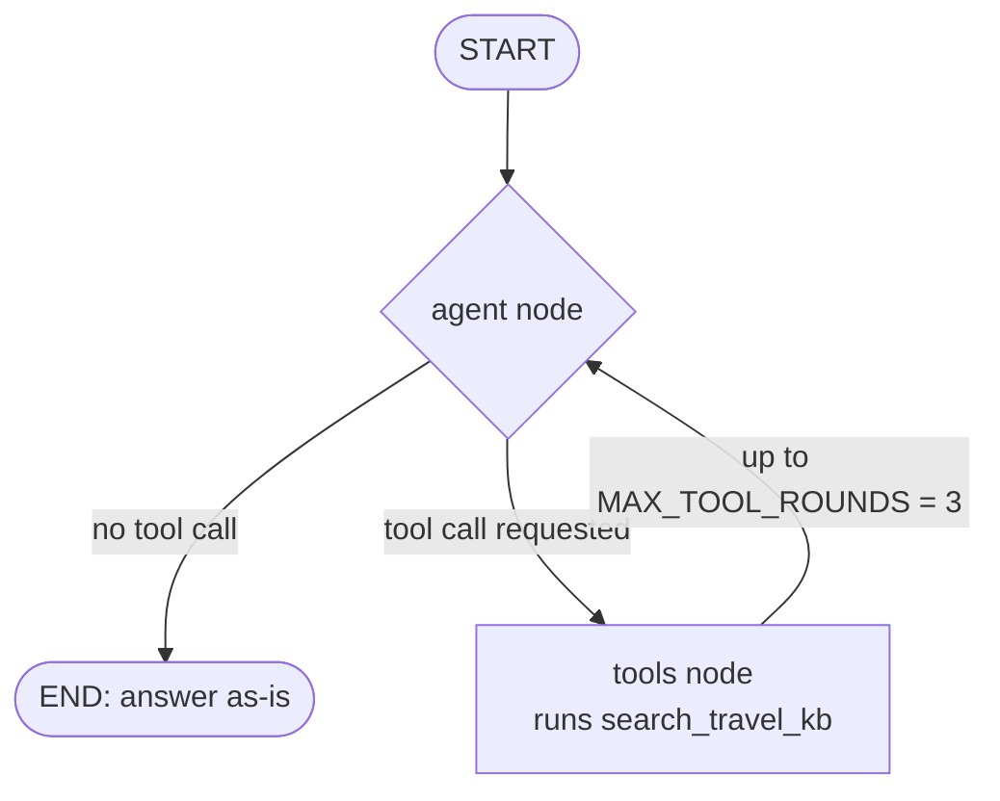

# Architecture

## Problem

Travelers researching a destination end up jumping between a dozen wiki
pages, forums, and guides to answer basic questions - what food to try,
how to get around, what neighborhoods are worth visiting. This project is
a chat assistant that answers those questions directly, grounded in a
curated knowledge base of destination articles (currently 20 cities from
Wikivoyage), instead of relying on the LLM's own general knowledge -
answers cite which article(s) they came from, and the assistant says so
plainly when it doesn't have relevant information rather than guessing.

## System components



## Retrieval → generation flow

The chat is not a fixed `retrieve → generate` pipeline. It's an agentic
LangGraph graph (`src/app/rag_graph.py`, class `RagAgent`) where the LLM
itself decides, per message, whether the question needs a knowledge-base
lookup at all:



- **`agent` node**: calls `gpt-4o-mini` with the `search_travel_kb` tool
  bound. For greetings/small talk/off-topic questions the model answers
  directly with no tool call - no wasted DB round-trip. For travel
  questions it emits a tool call with a search query drawn from the
  question.
- **`tools` node**: runs `search_travel_kb` - rewrites the query (see
  "Query rewriting" below), embeds it, hybrid-searches the knowledge base
  (reciprocal rank fusion of pgvector cosine search + Postgres full-text
  search), reranks the candidate pool with a cross-encoder, and returns the
  top `TOP_K` chunks. Results are appended to the conversation as a tool
  message and the graph loops back to `agent`.
- **System prompt** (`SYSTEM_PROMPT` in `rag_graph.py`) instructs the model
  to answer strictly from retrieved chunks or prior conversation history -
  never its own general/world knowledge, even when it "knows" the answer -
  and to say so plainly when nothing relevant was found. This was verified
  live: a general-knowledge question ("What is the capital of France?")
  gets refused even though the model obviously knows the answer, while a
  knowledge-base-covered question retrieves and answers normally.
- **`MAX_TOOL_ROUNDS = 3`** bounds worst-case latency/cost per message - once
  hit, the tool is no longer offered and the model must produce a final answer.

Conversation history is kept per `thread_id` via LangGraph's `InMemorySaver`
checkpointer, shared across the whole process (one `RagAgent` instance,
accessed through the cached `get_agent()` singleton) so multi-turn chats
resume correctly.

## Code layout (`src/`)

```
src/
├── app/            Chainlit entrypoint (main.py) + the RagAgent graph (rag_graph.py)
├── db/             RagRepository + ConversationRepository - all SQL lives here
├── ingestion/       source adapters: wikivoyage.py (live fetch), fixtures.py (demo data),
│                    ingestor.py (chunk + embed, source-agnostic)
├── evaluation/      retrieval.py (hit rate/MRR), ground_truth.py (question generation),
│                    llm_judge.py (LLM-as-judge answer scoring)
├── scripts/         thin CLI wiring only - one function call each, no business logic
├── tests/           pytest unit tests, class-based, no live DB/API calls
├── config.py        all tuning constants (model names, TOP_K, chunk size, pricing, RRF k)
├── embedding.py     embed_query/embed_documents/rerank_chunks (fastembed, cached singletons)
├── query_rewrite.py rewrite_query - LLM query rewriting, gated by QUERY_REWRITE_ENABLED
└── logger.py        loguru setup (dev: colorized DEBUG, prod: plain INFO via ENV_TYPE)
```

Persistence is two repository classes (`db/rag_data.py:RagRepository`,
`db/conversations.py:ConversationRepository`), each constructed with a
connection and holding it for the life of a `with db.db_session():` block -
no `conn`-threading through free functions, no self-connecting wrapper
duplication. See `ARCHITECTURE.md` at the repo root for the full review
and refactor history that produced this shape (kept as a standing design
record, not a doc meant for casual reading).

## Best practices applied

Per the course's list of RAG-improvement techniques beyond the naive
baseline:

- **Hybrid search** - reciprocal rank fusion of vector + full-text search
  (`RagRepository.hybrid_search`). Picked as the retrieval winner in
  evaluation, see [evaluation.md](evaluation.md).
- **Reranking** - a cross-encoder (`Xenova/ms-marco-MiniLM-L-6-v2`) reranks
  a 20-candidate hybrid pool down to the top 5 before generation.
- **Query rewriting** - a dedicated `gpt-4o-mini` call
  (`src/query_rewrite.py:rewrite_query`) rewrites the tool's `query` argument
  into a sharper standalone search query (fixes typos, expands
  abbreviations, resolves vague phrasing) before embedding/search.
  Toggleable via `Config.Retrieval.QUERY_REWRITE_ENABLED`
  (`QUERY_REWRITE_ENABLED` env var) without an image rebuild - **on by
  default**, despite scoring slightly below plain hybrid+rerank on this
  ground truth, see [evaluation.md](evaluation.md) for why.
- **Agentic RAG** - not one of the course's five named techniques, but a
  real improvement over a fixed pipeline: the model decides whether
  retrieval is needed at all, rather than always retrieving.

Not implemented (documented as a conscious gap, not an oversight):
small-to-big chunk retrieval (passing surrounding article context instead
of just the matched chunk) and document-metadata-based boosting (e.g.
biasing toward the article whose title matches a city named in the query).
