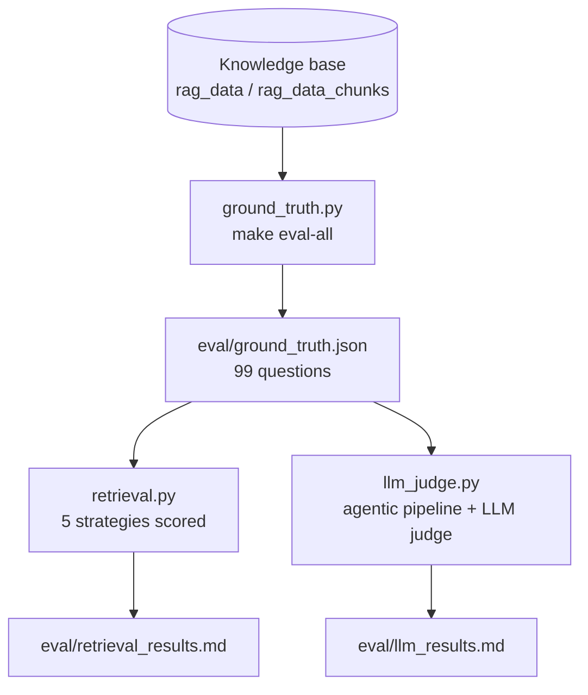

# Evaluation

Two separate evaluations, matching the course's split: how good is
*retrieval* on its own, and how good is the *final answer* the LLM
produces from what it retrieved.

Ground truth (`eval/ground_truth.json`, 99 questions) is generated by
sampling 5 chunks per ingested article and asking `gpt-4o-mini` to write
one question that can only be answered from that specific chunk
(`src/evaluation/ground_truth.py`, run via `make eval-all`). Each
question is tied to the exact chunk id it was generated from, so
retrieval can be scored against a known-correct answer.

## Retrieval evaluation

`make eval-all` (`src/evaluation/retrieval.py`) compares five
retrieval strategies over the ground-truth set, scored by Hit Rate@5
(did the correct chunk appear in the top 5?) and MRR@5 (mean reciprocal
rank - rewards ranking it higher, not just present):

| Approach | Hit Rate@5 | MRR@5 |
|---|---|---|
| vector (pgvector cosine) | 0.838 | 0.752 |
| text (Postgres `ts_rank`) | 0.182 | 0.182 |
| hybrid (reciprocal rank fusion) | 0.859 | 0.779 |
| **hybrid + rerank (winner)** | **0.889** | **0.852** |
| hybrid + rerank + query rewrite | 0.869 | 0.816 |

Full-text search alone is weak here (questions are phrased naturally, not
as keyword queries), vector search does most of the work, and hybrid +
cross-encoder reranking wins outright - this combination is what the live
`search_travel_kb` tool uses (`src/app/rag_graph.py`).

**Query rewriting** (`src/query_rewrite.py:rewrite_query`, a `gpt-4o-mini`
call that fixes typos/expands abbreviations/sharpens vague phrasing before
search) scores *worse* than plain hybrid+rerank on this ground truth. Most
likely explanation: the ground-truth questions are themselves generated by
an LLM asked to write a question answerable from one specific chunk
(see below), so they already sit close to the source article's vocabulary
- rewriting can drift a question away from that vocabulary rather than
toward it. Real user queries (typos, vague phrasing, shorthand) are the
case this technique targets, and this offline eval doesn't exercise that.
Despite the measured regression here, **`QUERY_REWRITE_ENABLED` defaults
to `true`** (`docs/configuration.md`) - the bet is that real user queries
(typos, vague phrasing, shorthand) look more like the messy case this
technique targets than this LLM-generated, source-vocabulary-aligned
ground truth does. Flip it off per-deployment (`QUERY_REWRITE_ENABLED=false`)
if live traffic or a future eval shows otherwise.

Current numbers as of the last `make eval-all` run - see
`eval/retrieval_results.md` for the live, regenerable copy (numbers will
drift slightly run-to-run if the knowledge base or ground truth is
regenerated, since Wikivoyage content itself can change between fetches).

## LLM (answer-quality) evaluation

`make eval-all` (`src/evaluation/llm_judge.py`) runs the full agentic
pipeline over the same ground-truth questions under two different system
prompts, then uses `gpt-4o-mini` as an LLM judge to score each answer's
relevance against the ground-truth chunk's content. Judge labels reuse the
same vocabulary as the `feedback.relevance` column (`RELEVANT` /
`PARTLY_RELEVANT` / `NON_RELEVANT`) instead of the course's binary
good/bad, so judge output is directly comparable to real user feedback on
the same Grafana panel.

| Variant | RELEVANT | PARTLY_RELEVANT | NON_RELEVANT | Tool called | Avg tool rounds | Total cost |
|---|---|---|---|---|---|---|
| concise | 62.6% | 8.1% | 29.3% | 66.7% | 0.67 | $0.0254 |
| **thorough (winner)** | **82.8%** | 12.1% | 5.1% | **88.9%** | 0.91 | $0.0352 |

- **concise**: tells the model to look things up when needed, keep answers short.
- **thorough**: explicitly tells the model to search before answering and to
  refine the query and search again if the first result looks incomplete,
  rather than guessing.

The gap is almost entirely explained by the "Tool called" column: the
concise prompt let the model skip retrieval more often (66.7% vs 88.9%),
and skipping retrieval is what produces non-relevant answers. `thorough` is
the current default `SYSTEM_PROMPT` in `src/app/rag_graph.py`.

Current numbers as of the last `make eval-all` run - see
`eval/llm_results.md` for the live, regenerable copy. Cost is the combined
generation + judge API cost for both variants together (~$0.06 for ~200
LLM calls total).

## Known gaps

- Trajectory-quality judging (evaluating the `search_travel_kb` query
  arguments themselves, separately from the final answer - the course's
  `14-agent-evaluation.md` split) isn't built. `eval/llm_results.md`
  reports tool-called % and avg tool rounds as a proxy, not a judged
  trajectory score.
- Retrieval and LLM evaluation both assume the ground truth matches the
  current state of the knowledge base - if you re-ingest or re-chunk,
  regenerate ground truth first (`make eval-all`) or scores will
  silently read close to zero (chunk ids no longer line up).
